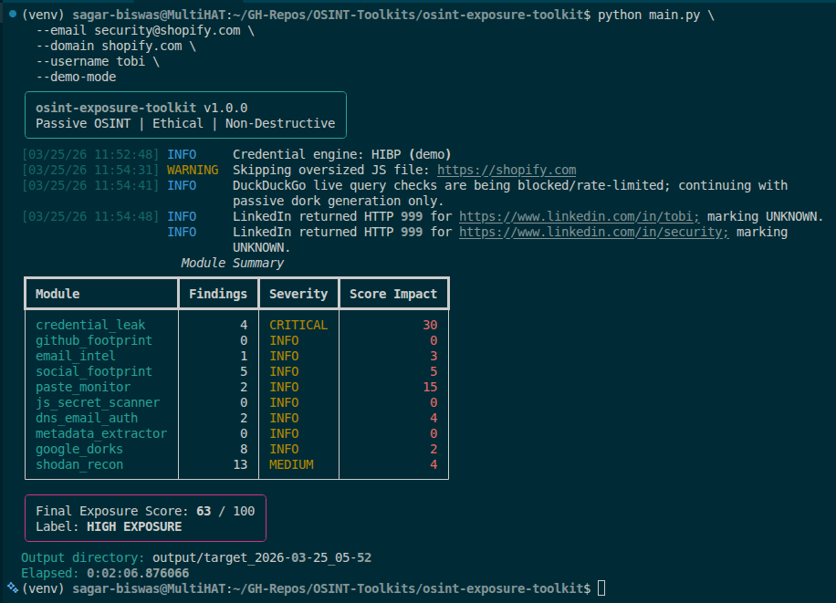
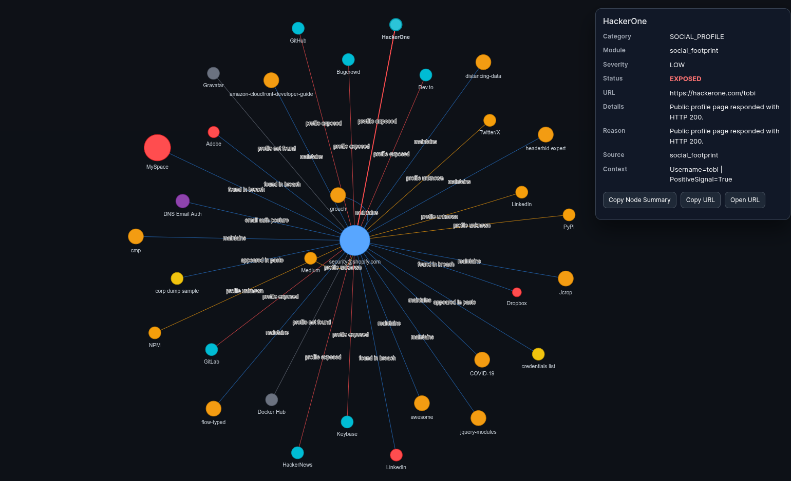
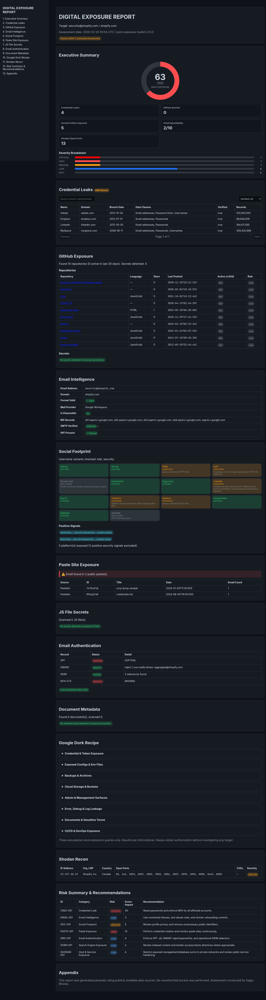
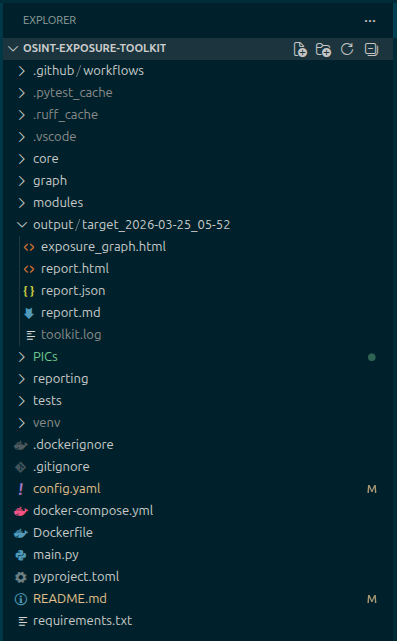

# OSINT Exposure Toolkit

<div align="right">


</div>

Passive, ethical OSINT toolkit for one practical question:

**How exposed is this person, account, or organization on the public internet right now?**

It collects public signals (credential leaks, public code, DNS/email posture, social exposure, indexed content, and Shodan metadata), scores them, and exports a report pack that is immediately usable by security teams or clients.

---

> Currently, I do not have premium access to HIBP/LeakCheck, which is why I tested using the "--demo-mode." However, I am confident that they will work perfectly.

### Pictures

<details>

<summary>Click to expand</summary>

<div align="center">









</div>

--- 

</details>

### Live Outputs: 

- exposure_graph.html: https://sagarbiswas-multihat.github.io/osint-exposure-toolkit/output/target_2026-03-25_05-52/exposure_graph.html

- report.html: https://sagarbiswas-multihat.github.io/osint-exposure-toolkit/output/target_2026-03-25_05-52/report.html

---

## Table of Contents

- [Who this is for](#who-this-is-for)
- [What this toolkit does](#what-this-toolkit-does)
- [What it does not do](#what-it-does-not-do)
- [How scoring works](#how-scoring-works)
- [Modules (end-to-end)](#modules-end-to-end)
- [Credential leak modes (important)](#credential-leak-modes-important)
- [Outputs](#outputs)
- [Project structure](#project-structure)
- [Setup](#setup)
- [Configuration guide](#configuration-guide)
- [CLI usage](#cli-usage)
- [Examples by scenario](#examples-by-scenario)
- [Troubleshooting](#troubleshooting)
- [Testing and quality](#testing-and-quality)
- [Ethics and legal use](#ethics-and-legal-use)
- [License](#license)

---

## Who this is for

This project is useful if you are:

- a security consultant preparing a pre-assessment exposure baseline,
- a startup security engineer building a lightweight external exposure check,
- a blue team member who needs repeatable, passive recon snapshots,
- a portfolio builder demonstrating practical AppSec + OSINT automation.

---

## What this toolkit does

Given any combination of `--email`, `--domain`, and `--username`, the toolkit:

1. Runs a passive scan pipeline across enabled modules.
2. Normalizes findings into typed models.
3. Aggregates a score (0–100) with severity label.
4. Produces HTML, JSON, Markdown, and graph outputs.

The result is a single timestamped folder under `output/` you can share or archive.

---

## What it does not do

This toolkit does **not** perform:

- exploitation,
- brute force,
- payload delivery,
- vulnerability proof-of-exploit,
- unauthorized access of any kind.

It is intentionally passive and report-oriented.

---

## How scoring works

Each module contributes a bounded `score_impact`, and total score is capped at `100`.

- Low score = lower observed public exposure.
- High score = broader or more critical public exposure.

The scoring layer also creates normalized finding IDs (for example, module-prefixed finding references) so remediation tracking is easier across repeated runs.

---

## Modules (end-to-end)

1. **Credential Leak**
   - Engine: LeakCheck (default) or HIBP (opt-in)
   - Output: breach count, severity, and mode-specific notes

2. **GitHub Footprint**
   - Discovers public repositories and flags secret-like patterns

3. **Email Intelligence**
   - Email syntax, MX provider hints, SPF hints, SMTP verification signal

4. **Social Footprint**
   - Username variant probing across configured platforms

5. **Paste Monitor**
   - Uses credential leak context to summarize paste exposure

6. **JS Secret Scanner**
   - Scans public JavaScript artifacts for secret-like patterns

7. **DNS Email Authentication**
   - SPF, DMARC, DKIM, MTA-STS posture and spoofability score

8. **Google Dorks**
   - Generates passive dork recipes and optional limited DDG checks

9. **Metadata Extractor**
   - Pulls leaked metadata from public docs

10. **Shodan Recon**
    - Host/service/port/CVE exposure metadata for target domain assets

11. **Exposure Scorer + Reporting**
    - Unifies all module outputs into score + HTML/JSON/MD + graph

---

## Credential leak modes (important)

Credential leak scanning supports two engines.

### 1) LeakCheck (default)

- Selected automatically unless HIBP flags are used.
- With API key: authenticated mode (richer source detail).
- Without API key or rejected key: public mode fallback.

### 2) HIBP (opt-in)

Use one of:

- `--use-hibp` (interactive mode choice)
- `--free-hibp`
- `--demo-mode`

HIBP modes:

- **Free**: global breach landscape view (not per-email premium lookup)
- **Live/Premium path**: per-email endpoint usage when key is configured
- **Demo**: fixture-backed deterministic output from `tests/fixtures/hibp_mock.json`

> `--demo-mode` is ideal for demos, CI smoke runs, and report-template validation.

---

## Outputs

Each run creates a folder like:

`output/target_YYYY-MM-DD_HH-MM/`

Generated artifacts:

- `report.html` — interactive client-facing report
- `report.json` — machine-readable payload for automation
- `report.md` — concise text report for quick sharing
- `exposure_graph.html` — graph visualization (unless `--no-graph`)

---

## Project structure

```text
main.py
core/
  config_loader.py
  constants.py
  logger.py
  models.py
  rate_limiter.py
modules/
  credential_leak.py
  github_footprint.py
  email_intel.py
  social_footprint.py
  paste_monitor.py
  js_secret_scanner.py
  dns_email_auth.py
  google_dorks.py
  metadata_extractor.py
  shodan_recon.py
  exposure_scorer.py
reporting/
  html_report.py
  json_report.py
  markdown_report.py
  templates/report.html.jinja
graph/
  exposure_graph.py
tests/
```

---

## Setup

### Local (recommended)

```bash
python -m venv .venv
source .venv/bin/activate
pip install -r requirements.txt
```

### Docker

```bash
docker build -t osint-exposure-toolkit .
docker run --rm -v $(pwd)/output:/app/output osint-exposure-toolkit --domain example.com --demo-mode
```

### Docker Compose

```bash
docker compose up --build
```

---

## Configuration guide

Main config file: `config.yaml`

Key sections:

- `general`
  - output directory, log level, timeout, concurrency, default output formats
- `api_keys`
  - `hibp`, `leakcheck`, `github`, `shodan`
- `modules`
  - enable/disable each module independently
- `rate_limits`
  - request pacing per provider
- `scan_limits`
  - safety caps for repository, file, and host volume

### Security recommendation

Do not commit real API keys into version control.

Use one of these approaches:

- local untracked config,
- environment-variable templating,
- secret manager injection in CI/CD.

---

## CLI usage

```bash
python main.py [OPTIONS]
```

### Core target options

- `--email TEXT`
- `--domain TEXT`
- `--username TEXT`

At least one is required.

### Credential engine options

- `--use-hibp`
- `--free-hibp`
- `--demo-mode`

Note: `--use-hibp` cannot be combined with `--free-hibp` or `--demo-mode`.

### Execution controls

- `--skip-pastes`
- `--modules TEXT` (comma-separated aliases)
- `--output TEXT` (comma-separated: `html,json,md`)
- `--no-graph`
- `--config TEXT` (default: `config.yaml`)

### Module aliases for `--modules`

- `cred`
- `github`
- `email`
- `social`
- `pastes`
- `js`
- `dns`
- `metadata`
- `dorks`
- `shodan`

---

## Examples by scenario

### 1) Fast demo run (recommended first run)

```bash
python main.py --email demo@example.com --domain example.com --username demo --demo-mode
```

### 2) Default real-world run (LeakCheck path)

```bash
python main.py --email security@example.com --domain example.com --username secops
```

### 3) HIBP interactive path

```bash
python main.py --email security@example.com --domain example.com --use-hibp
```

### 4) Domain-only exposure check

```bash
python main.py --domain example.com
```

### 5) Focused module run

```bash
python main.py --domain example.com --modules github,js,dns,shodan
```

### 6) Output customization

```bash
python main.py --email user@example.com --domain example.com --output html,json --no-graph
```

### 7) Tested 

```bash
python main.py \
  --email security@shopify.com \
  --domain shopify.com \
  --username tobi \
  --demo-mode
```

---

## Troubleshooting

### Demo mode shows empty Credential Leaks table

- Ensure you are opening the newly generated `report.html` in the latest output folder.
- Hard-refresh browser cache.
- Confirm `--demo-mode` was used and `tests/fixtures/hibp_mock.json` exists.

### “At least one of --email, --domain, or --username is required.”

Provide one or more target identifiers.

### Missing optional integrations

If API keys are empty, modules still run in reduced capability mode where possible.

### Slow runs or rate-limit behavior

Tune `rate_limits` and `scan_limits` in `config.yaml` for your environment.

---

## Testing and quality

```bash
ruff check .
python -m pytest tests/ -v
```

Suggested release gate:

1. Lint clean.
2. Tests green.
3. One CLI smoke run (`--demo-mode`) and confirm output artifacts.

---

## Ethics and legal use

Use this toolkit only on assets you own or are explicitly authorized to assess.

The toolkit is intentionally passive, but passive reconnaissance can still create legal or contractual risk in some environments without prior approval.

---

## License

MIT
